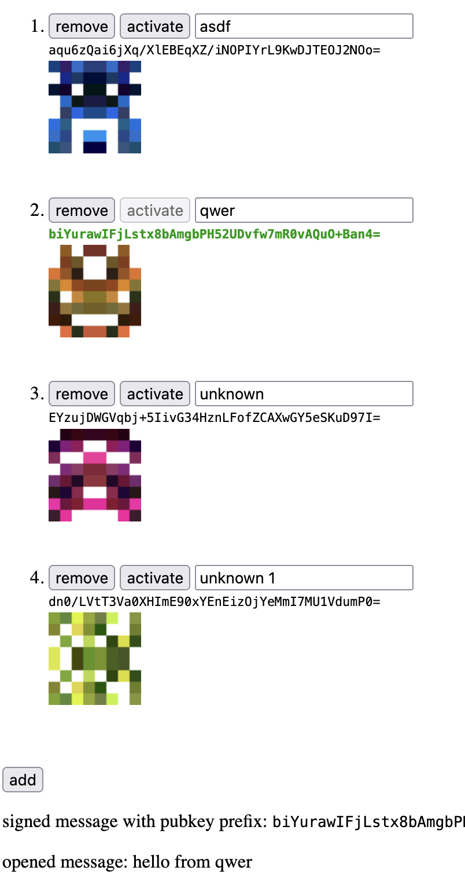

# @stevvvns/device-accounts

## What?

This library just saves some `tweetnacl` signing keys in `localStorage`, which you can use as mostly-persistent identifiers for the user's device. It doesn't have anything to do with device fingerprinting, and is mostly only usable in combination with `@stevvvns/incomponent` since the API is mostly contained in `stores/accounts`, which requires it.

## Why?

I like making services you don't have to log in to. You do end up having to implement device connecting/recovery codes/give up and make an account anyway at some point to get around `localStorage` being somewhat volatile, but I'll probably add that here when I get around to it.

## How?

`$ npm i --save @stevvvns/device-accounts`

[`src/example-app.js`](./src/example-app.js) shows how to use with incomponent.

